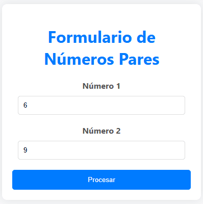

# Formulario de Números Pares

Esta actividad web permite a los usuarios ingresar dos números y, tras procesar los datos, muestra todos los números pares que se encuentran entre los dos valores ingresados. La aplicación utiliza HTML y CSS para la interfaz de usuario, y PHP para el procesamiento del lado del servidor.

  

El script PHP procesa los datos ingresados en el formulario:

Obtención de Datos: Recibe los números ingresados a través de $\_POST.

- **Validación de Datos:** Verifica que los números sean diferentes; de lo contrario, muestra una alerta y redirige al formulario inicial.

- **Cálculo de Números Pares:** Si los números son válidos, calcula todos los números pares entre los dos valores ingresados.

- **Generación de Salida:** Imprime los números pares encontrados y proporciona un enlace para regresar al formulario inicial.

Esta actividad demuestra habilidades en el desarrollo de aplicaciones web interactivas utilizando tecnologías de front-end y back-end, ofreciendo una experiencia de usuario eficiente y visualmente agradable.

**Consulta la versión preliminar de la actividad aquí:** [https://ejercicio_02.com](https://alejandrovillegas.net/projects/exercise-02/index.html)

# 📌 Información de la Actividad

Esta actividad ha sido desarrollado como parte del portafolio de soluciones tecnológicas, con el objetivo de ofrecer una herramienta eficiente y funcional para usuarios autodidactas interesados en la gestión y desarrollo de proyectos web.

- **Área**: Desarrollo de Actividades Web

- **Usuario Final**: TecNM

- **Fecha de Desarrollo**: 04 de febrero de 2018

- **Portafolio de Proyectos**: [www.alejandrovillegas.net](https://www.alejandrovillegas.net/)

## 🔧 Guía de Instalación y Configuración de la Actividad

1. Descargue y descomprima el archivo del proyecto en su sistema local.

La actividad ahora está funcionando en su entorno local. 🎉
